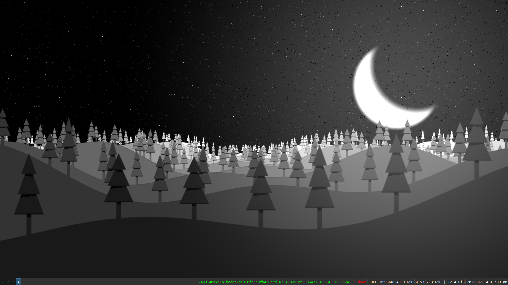
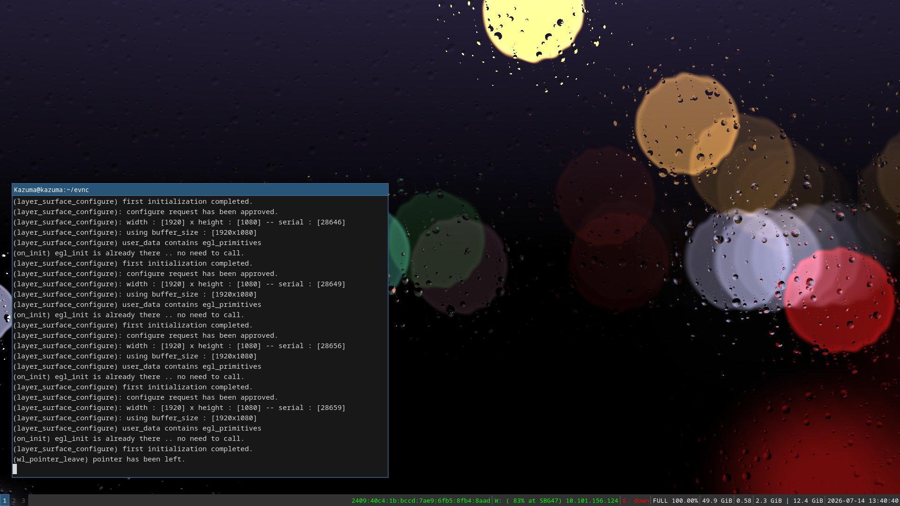

# Evnc - wlroots based shader-runtime
This project is a `wlroots`-based shader-runtime engine that serves as a live-wallpaper utility for Wayland environments.

---
<p align="center">
   
   
</p> 
<p align="center"> 
   
</p>

## Table of Contents
* [Documentation](#documentation)
* [Cloning](#cloning)
* [Prerequisites](#prerequisites)
* [Compilation](#compilation)
* [Installation](#installation)
* [Running](#running)
* [Shaders](#shaders)
* [Uninstalling](#uninstalling)
* [Contributing](#contributing)
* [Copyright](#copyright)
* [Known Issues](#known-issues)

---

## Documentation
Because this project is actively evolving, exhaustive API documentation is currently under construction. Core protocols and desktop configurations are tightly aligned with native Wayland and Sway standards, making standard ecosystem guides a great reference point.

## Cloning
You can clone the upstream repository directly using:
```bash
git clone https://github.com/itsarunstark/evnc.git 
# Or specify a custom target directory:
git clone https://github.com/itsarunstark/evnc.git evnc-git

# To pull down updates:
cd evnc # or evnc-git or whatever folder you named
git pull --set-upstream origin main

```

## Prerequisites

Ensure your Linux distribution has the following development libraries and build suites installed before compiling:

-   `make` – Build automation tool.
    
-   `gcc` / `clang` – Or any standard C99 compatible C compiler toolchain.
    
-   `wayland-client` – Core protocol library (`libwayland-dev` on Debian/Ubuntu or `wayland-devel` on Fedora).
    
-   `zwlr_layer_shell_v1` – Global protocol interface exposed by `wlroots`-based compositors (e.g., Sway, River).
    
-   `mesa` / `EGL` – Driver infrastructure for modern hardware-accelerated OpenGL / GLES graphics.
    

## Compilation

Compile the project locally inside your root repository directory by executing:

Bash

```
cd evnc # Or your designated clone path
make

```

## Installation

It is highly recommended to manually [run](#running) the program from the local binary folder to evaluate layout performance before full installation. The default system path is `PREFIX=/usr/local` (which can be configured inside the `Makefile`).

To install the binary and assets system-wide, use:

Bash

```
sudo make install
# Or override the prefix parameters directly:
sudo make PREFIX=/usr/local install

```

## Running

To execute the engine manually from the terminal, pass your GLSL shader targets and timing configurations as command line arguments:

Plaintext

```
Flags:
    -v, --vertex <vertex-shader-file>    Path to the GLSL vertex shader source.
    -f, --fragment <fragment-shader-file>  Path to the GLSL fragment shader source.
    -n, --no-pause                       Do not pause when the focus is lost
    -t, --timestep <ab.cd>               Frame delay step (e.g., 60.00, 30.00). 
                                         Higher values increase the delay between frames.

```

### Quick Run
```bash
make run
```
### Example Usage

```bash
./bin/evnc -v ./share/vertex.glsl -f ./share/fragment.glsl -t 60.0
#or no-pause
./bin/evnc -v ./share/vertex.glsl -f ./share/fragment.glsl -t 60.0 -n
```


### Autostart Configuration

To auto-launch this application cleanly in the background upon login, append an execution rule into your compositor's main configuration file (e.g., `$HOME/.config/sway/config`):

Plaintext

```
exec_always --no-startup-id evnc -v $HOME/share/vertex.glsl -f $HOME/share/fragment.glsl -t 60.00 > $HOME/main.log 2>&1

```

>  **Note on Shader Paths:** Ensure your vertex and fragment source code targets are placed in the precise path targeted by your startup flags (in this example configuration, `$HOME/share/vertex.glsl` and `$HOME/share/fragment.glsl`).

## Shaders

The engine runtime exposes the following dynamic uniforms to your custom shader files:

OpenGL Shading Language

```
u_mouse : vec2
u_resolution : vec2
u_time : float

```

If you are importing asset files designed specifically for Shadertoy, you must refactor the variable names inside your code block accordingly:

-   Rename `iTime` to `u_time`
    
-   Rename `iResolution` to `u_resolution`
    
-   Rename `iMouse` to `u_mouse`
    

_Shaders utilized within this project's default configurations were built by or inspired by lessons from [The Art of Code](https://www.youtube.com/TheArtofCodeIsCool)._

## Uninstalling

To cleanly remove all compiled binaries and system assets from your system directories, trigger the uninstall loop:

Bash

```
sudo make PREFIX=/usr/local uninstall

```

## Contributing

Contributions, performance profiling, and pipeline optimizations are always welcome! Feel free to open GitHub issues, submit detailed Pull Requests, or reach out to the developer directly via email.

## Copyright

Plaintext

```
SPDX-License-Identifier: GPL-2.0-only

Copyright (C) 2026 Arun Kumar
<23u02086@iiitbhopal.ac.in>
<bg47msva@gmail.com>

This program is free software; you can redistribute it and/or modify
it under the terms of version 2 of the GNU General Public License
as published by the Free Software Foundation.

This program is distributed in the hope that it will be useful,
but WITHOUT ANY WARRANTY; without even the implied warranty of
MERCHANTABILITY or FITNESS FOR A PARTICULAR PURPOSE. See the
GNU General Public License for more details.

You should have received a copy of the GNU General Public License
along with this program. If not, see [https://www.gnu.org/licenses/](https://www.gnu.org/licenses/).

```

## Known Issues

-   The program gracefully terminates if master-DRM access is briefly dropped or revoked by the system compositor (e.g., switching out to alternative Virtual Terminals via `Ctrl+Alt+F*`).
    
-   Currently lacks native runtime pipelines for processing external image files or mapping explicit 2D texture samplers.
